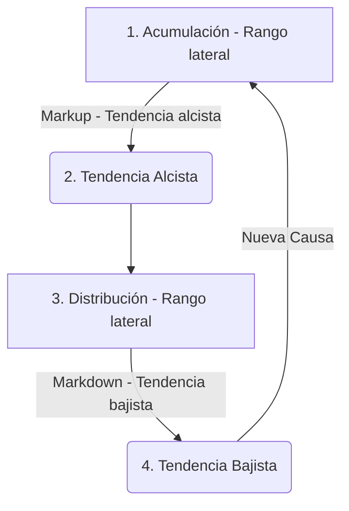

# El Método Wyckoff

Metodología de análisis técnico y chartismo cuantitativo desarrollada por Richard Wyckoff. Estudia la acción del precio y el volumen para identificar los procesos de acumulación (compras) y distribución (ventas) liderados por grandes operadores institucionales (Composite Operator).

---

## 🗺️ Enfoque de 5 Pasos para el Mercado

1. **Determinar la posición y tendencia probable del mercado**: Identificar si el mercado está en consolidación (rango) o tendencia. Analizar la oferta y la demanda para proyectar la dirección futura cercana.
2. **Seleccionar activos en armonía con la tendencia**: En tendencia alcista, operar activos más fuertes que el índice de mercado; en tendencia bajista, elegir los más débiles.
3. **Seleccionar activos con una "Causa" suficiente**: Elegir activos en acumulación o reacumulación que hayan construido una causa lo suficientemente grande (proyectada por conteos de Punto y Figura) para satisfacer tus objetivos mínimos de beneficio.
4. **Determinar la disposición del activo a moverse**: Aplicar los test de compra o venta (9 test) para comprobar que la oferta o demanda flotante se ha absorbido exitosamente.
5. **Sincronizar las operaciones con los giros del mercado general**: Coordinar el inicio de la posición con la reversión o aceleración del índice bursátil general para aumentar las probabilidades de acierto (tres cuartas partes de los activos se mueven en armonía con el mercado).

---

## 📐 Las 3 Leyes Fundamentales

1. **Ley de Oferta y Demanda**:
   - Si Demanda > Oferta $\Rightarrow$ El precio sube.
   - Si Oferta > Demanda $\Rightarrow$ El precio baja.
2. **Ley de Causa y Efecto**:
   - Todo movimiento tendencial (efecto) requiere una preparación lateral previa (causa). La magnitud del recorrido resultante es directamente proporcional al tiempo de consolidación acumulado en el rango.
3. **Ley de Esfuerzo y Resultado**:
   - El volumen representa el esfuerzo, y el cambio en el precio es el resultado. Si hay un volumen inusualmente alto (esfuerzo) pero el precio apenas se desplaza (sin resultado), indica que la fuerza contraria está absorbiendo las órdenes (p. ej. demanda absorbiendo ventas de pánico).

---

## 🔄 El Ciclo de Mercado (Fases Macro)

---

## 🔍 Secuencia de Eventos en Rango (Acumulación)

1. **PS (Soporte Preliminar)**: Compras institucionales iniciales que detienen parcialmente la caída.
2. **SC (Selling Climax)**: Clímax de ventas por pánico minorista. Volumen extremo. Define el soporte del rango.
3. **AR (Automatic Rally)**: Rebote automático provocado por el cierre de cortos institucionales. Define la resistencia del rango (Creek) y marca el primer cambio de carácter (**CHoCH**).
4. **ST (Secondary Test)**: Test de la zona del SC para confirmar la disminución de la presión de venta. Cierra la **Fase A**.
5. **Sacudida (Spring)**: Falso rompimiento del soporte del rango para barrer stops y atrapar vendedores. Es el evento clave de la **Fase C**.
   - *Tipo #1 (Terminal)*: Penetración profunda, volumen muy alto. Alto riesgo.
   - *Tipo #2*: Penetración media, volumen moderado. Exige test posterior.
   - *Tipo #3*: Mínima penetración, volumen muy bajo. Denota oferta agotada. Entrada de alta probabilidad.
6. **SOS (Sign of Strength)**: Rompimiento al alza del Creek con volumen en aumento. Marca el cambio definitivo a tendencia (**Fase D**).
7. **LPS / BUEC (Last Point of Support)**: Retroceso correctivo de bajo volumen que valida el Creek roto como nuevo soporte. Punto óptimo de entrada.

---

## ⚖️ Los Nueve Test de Compra y Venta

Los 9 test de Wyckoff guían con precisión las entradas al mercado e indican cuándo la consolidación está por terminar y la línea de menor resistencia se define.

### Nueve Test de Compra (Acumulación)
1. **Objetivo bajista cumplido**: Proyección cumplida en gráficos de Punto y Figura (P&F).
2. **Estructura de parada visible**: Presencia de PS, SC, AR y ST en el gráfico de velas.
3. **Actividad alcista**: El volumen aumenta en los rallies alcistas y disminuye en las reacciones correctivas bajistas.
4. **Línea de tendencia rota**: Ruptura de la línea de tendencia bajista o canal de oferta.
5. **Mínimos más altos**: Confirmación de soporte ascendente.
6. **Máximos más altos**: Mayor progresión de la demanda.
7. **Fortaleza relativa**: El activo muestra mayor fortaleza que el mercado general (es decir, sube con más fuerza y resiste mejor las caídas).
8. **Base construida**: Suelo o línea de soporte horizontal consolidada durante meses.
9. **Ratio Riesgo/Beneficio favorable**: El objetivo proyectado (TP) es al menos tres veces superior a la pérdida si se alcanzara el Stop Loss (R:R > 3:1).

### Nueve Test de Venta (Distribución)
1. **Objetivo alcista cumplido**: Proyección de P&F cumplida.
2. **Actividad bajista**: El volumen disminuye en los rallies y aumenta en las reacciones bajistas.
3. **Estructura de distribución visible**: Presencia de PSY y BC en el gráfico de velas.
4. **Debilidad relativa**: El precio es más sensible a las caídas que el mercado y reacciona de forma más lenta a las subidas.
5. **Línea de soporte rota**: Ruptura de la línea de soporte o tendencia alcista de la estructura.
6. **Máximos más bajos**: Incapacidad de superar resistencia.
7. **Mínimos más bajos**: Confirmación de quiebres de soporte.
8. **Formación de corona**: Consolidación lateral de distribución visible en P&F.
9. **Ratio Riesgo/Beneficio favorable**: El objetivo bajista de ganancia es al menos tres veces el riesgo del Stop Loss (R:R > 3:1).

---

## 🎯 Directrices Operativas del Método

### 1. Zonas de Operación
- **Zona 1 (Sacudida)**: Entrada en el Test del Spring/UTAD en Fase C. Ofrece la mejor relación riesgo/beneficio.
- **Zona 2 (Rotura)**: Entrada en el test de confirmación (LPS/BUEC) tras romper el rango en Fase D. Ofrece mayor probabilidad.
- **Zona 3 (Tendencia)**: Incorporación al impulso en Fase E mediante retrocesos de continuación.

### 2. Gatillos de Entrada (Velas de Intención)
- **1 Vela**: Pinbar/Martillo (rechazo con mecha larga en el soporte/resistencia).
- **2 Velas**: Vela envolvente (engulfing) que confirma el giro.
- **Esquema Rápido**: Mini-rango acumulativo fractal en la zona clave.

### 3. Filtro de Entrada (Órdenes Stop)
- Se desaconsejan las entradas a mercado directa o con órdenes limitadas (que intentan adivinar el precio exacto del giro).
- **Regla de Wyckoff**: Utilizar órdenes de entrada tipo **Stop** (Buy Stop arriba de la vela gatillo para compras; Sell Stop abajo para ventas). Si el precio continúa cayendo/subiendo de largo, la orden nunca se ejecuta y se cancela la operación fallida.

### 4. Gestión de Riesgos
- **Stop Loss**: Por debajo del mínimo del Spring (escenario invalidado) o por debajo del gatillo (más ajustado).
- **Take Profit 1**: En la resistencia del rango original (Creek). Asegura ganancias y se coloca Stop en breakeven.
- **Take Profit 2**: En la siguiente resistencia estructural mayor de marcos temporales superiores.

### 5. Proyección de Objetivos (Causa y Efecto con P&F)
- **Conteo Horizontal de Columnas**: El número de columnas horizontales dentro del rango de consolidación (causa) en el gráfico de Punto y Figura proyecta la extensión potencial del movimiento fuera del rango (efecto).
- **Fórmula de Proyección**:
  $$\text{Objetivo} = (\text{Número de Columnas} \times \text{Tamaño de Caja} \times \text{Reversión}) + \text{Punto de Referencia}$$
  *El punto de referencia puede ser la línea de conteo, el mínimo del rango o el punto medio de la estructura.*
- **Directriz de Uso**: Las proyecciones de P&F estiman zonas de "detenerse, mirar y escuchar". No son puntos exactos de reversión, sino niveles de alta probabilidad donde la tendencia podría ralentizarse o revertirse. Se deben contrastar con el análisis de volumen y precio en el gráfico de velas ordinario a medida que el precio se aproxima al objetivo.

---

## 🧡 Aplicación Exclusiva en Bitcoin (BTC/USDT)

La aplicación del método Wyckoff en Bitcoin requiere adaptaciones debido a las dinámicas propias de liquidez y apalancamiento en el mercado cripto:

1. **Frecuencia de Sacudidas (Springs profundos)**:
   - BTC es altamente propenso a barridos de liquidez agresivos. Los Springs en BTC suelen ser de **Tipo #1 (Terminal Shakeouts)** debido a la liquidación forzada de posiciones apalancadas. La recuperación posterior debe ser sumamente veloz; si el precio permanece por debajo del soporte más de unas cuantas velas, el escenario alcista queda descartado.
2. **Temporalidades Recomendadas**:
   - Debido al ruido de alta frecuencia (HFT y bots de arbitraje), las estructuras Wyckoff en BTC son altamente confiables en temporalidades de **4 Horas (4h)** y **Diario (1d)**. Los rangos intradía (menores a 1h) sufren de excesivas señales falsas.
3. **Firmas de Volumen e Interés Abierto (Open Interest)**:
   - Un clímax de ventas (SC) legítimo en BTC coincide con picos masivos de liquidaciones de posiciones largas en los derivados y tasas de financiación (*funding rates*) negativas.
   - Un clímax de compras (BC) en distribución coincide con euforia en redes sociales, primas elevadas en contratos de futuros y tasas de financiación sumamente positivas.
4. **Filtro Estricto de Entrada**:
   - En BTC, debido a las rápidas mechas de liquidación, la regla de entrar con **órdenes Stop** por encima del gatillo es crítica. Entrar con órdenes limitadas en zonas de soporte suele resultar en ser arrastrado por las mechas de liquidación sistemática.
